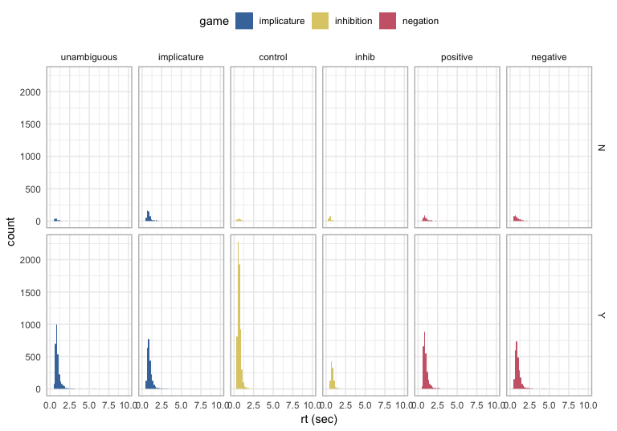
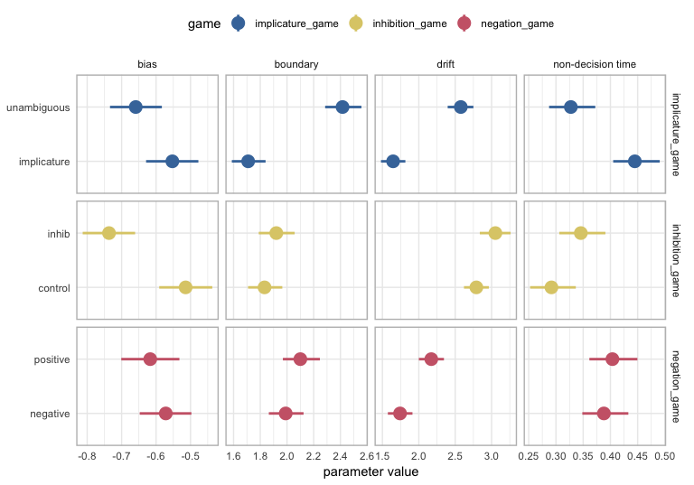
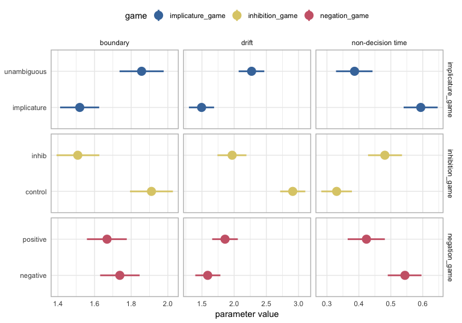
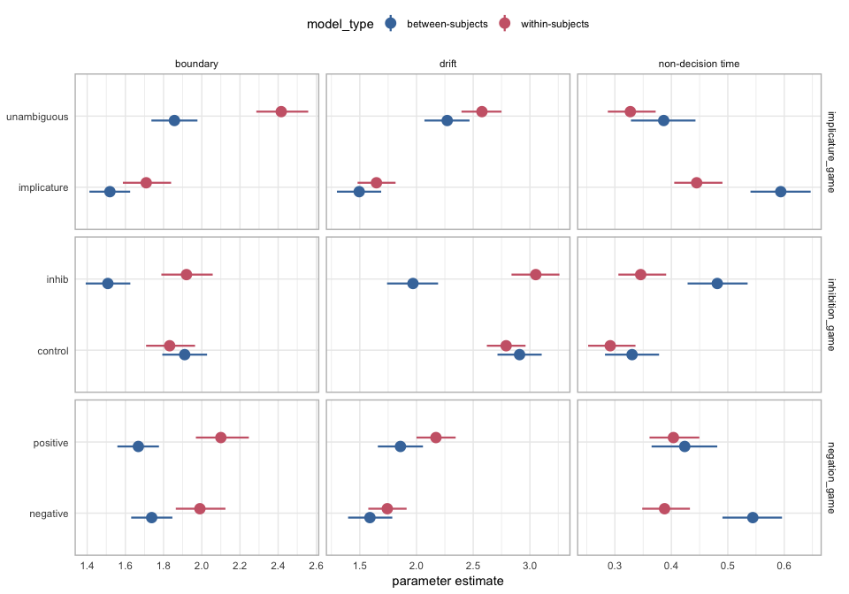
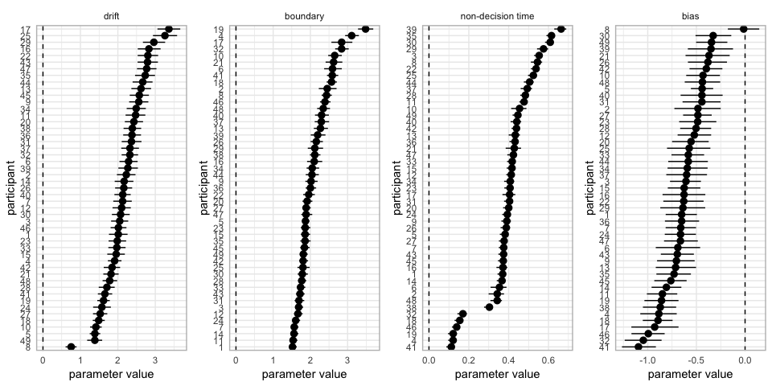
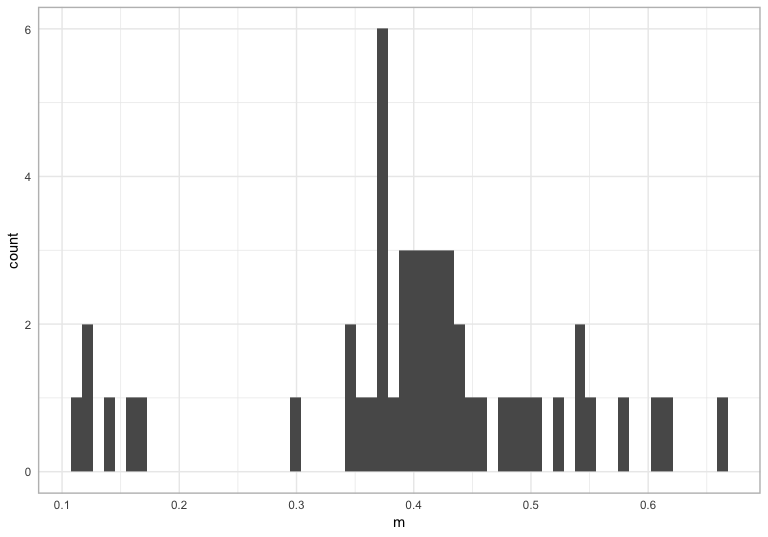
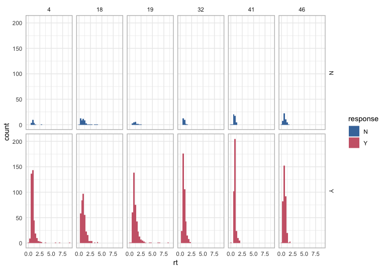
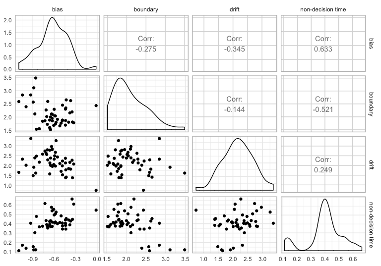

Neginhib HDDM Visualization
================

## Setup

``` r
source("../hddm_helpers.R")
d <- read_csv("../../data/raw_data/neginhib_adult_hddm.csv") 
d_mcmc <- feather::read_feather("../../data/model_traces/neginhib-mcmc-within-tidy.feather")
d_mcmc_between <- feather::read_feather("../../data/model_traces/neginhib-mcmc-between-tidy.feather")
```

## Plot Correct vs. Incorrect RTs

Note this is just adult data.

``` r
upper_bound_rt <- 10

d %>% 
  filter(rt <= upper_bound_rt) %>% 
  mutate(trial.type = as_factor(trial.type)) %>% 
  ggplot(aes(x = rt, fill = game)) +
  geom_histogram(bins = 60) +
  facet_grid(response ~ trial.type) +
  lims(x = c(0, upper_bound_rt)) +
  labs(x = "rt (sec)", fill = "game") +
  guides(color = F) +
  scale_fill_ptol() +
  scale_color_ptol() +
  theme(legend.position = "top") 
```



## Plot HDDM parameter estimates

Details about the HDDM model are in this [Jupyter
Notebook](https://github.com/ejyoon/neginhib/blob/kyle_hddm/analysis/hddm_analysis/code/hddm_fit/neginhib-hddm.ipynb).

Here are the results from fitting the model using the RWeiner package,
which we can compare to the HDDM output. But note that the two analyses
used different filtering for RTs.

  - RWeiner:
      - RT \>= 0.2 and RT \<= 15 seconds
      - RTs +/- 3 stdevs
  - HDDM:
      - RT \>= 0 and RT \<= 2 seconds

I realized there was a difference in the RT filters after I had already
fit the HDDM (takes ~20 hours). I figured this was probably not the
final model, so we can discuss how we want to filter RTs and then re-fit
the within-subjects HDDM.


Summary of RWeiner results:

1.  Inhibition
      - Drift: no difference
      - Boundary: no difference
      - NDT: lower for control trials
2.  Implicature
      - Drift: higher for unambiguous trials
      - Boundary: higher for unambiguous trials
      - NDT: no difference
3.  Negation
      - Drift: no difference, but maybe higher for positive trials
      - Boundary: no difference, but maybe higher for negative trials
      - NDT: higher for positive trials

### Within-subjects HDDM group-level parameter estimates

``` r
ms <- d_mcmc %>% 
  filter(param_level == "group", statistic == "map") %>% 
  group_by(param_type, condition_clean, game, plot_order) %>% 
  summarise(m = mean(group_param_estimate),
            ci_lower = quantile(group_param_estimate, probs = 0.025),
            ci_upper = quantile(group_param_estimate, probs = 0.975)) 

ms %>% 
  ggplot(aes(x = fct_reorder(condition_clean, plot_order, .desc = F),
             y = m, 
             color = game)) +
  geom_pointrange(aes(ymin = ci_lower, ymax = ci_upper), size = 1) +
  facet_grid(game~param_type, scales = "free") +
  coord_flip() +
  labs(y = "parameter value", x = NULL) +
  scale_color_ptol() +
  theme(legend.position = "top")  
```



1.  Inhibition
      - Drift: higher for control trials
      - Boundary: no difference
      - NDT: high overlap
2.  Implicature
      - Drift: higher for unambiguous trials
      - Boundary: higher for unambiguous trials
      - NDT: maybe higher for implicature trials
3.  Negation
      - Drift: some overlap, but maybe higher for positive trials
      - Boundary: higher for positive trials
      - NDT: some overlap, but maybe higher for negative trials

### Between-subjects HDDM group-level parameter estimates

``` r
ms_between <- d_mcmc_between %>% 
  filter(param_level == "group") %>% 
  group_by(param_type, condition_clean, game, plot_order) %>% 
  summarise(m = mean(estimate),
            ci_lower = quantile(estimate, probs = 0.025),
            ci_upper = quantile(estimate, probs = 0.975)) 

ms_between %>% 
  ggplot(aes(x = fct_reorder(condition_clean, plot_order, .desc = F),
             y = m, 
             color = game)) +
  geom_pointrange(aes(ymin = ci_lower, ymax = ci_upper), size = 1) +
  facet_grid(game~param_type, scales = "free") +
  coord_flip() +
  labs(y = "parameter value", x = NULL) +
  scale_color_ptol() +
  theme(legend.position = "top")  
```



  - Higher drift rates for neg-positive, imp-unambiguous, and
    inhib-control trials (similar to the RWeiner and within-subjects
    HDDM).
  - differences in non-decision time estimates across trial types
    (similar to RWeiner BUT different from the within-subjects HDDM).
  - higher boundary for unambigous trials in the implicature game
    (similar to RWeiner and within-subjects HDDM)
  - higher boundary for control trials in the inhibition game (different
    from RWeiner and within-subjects HDDM)
  - no difference in boundary for negation trials (similar to RWeiner
    but different from withins-subjects HDDM)

### Plot the within and between subjects estimates together

``` r
d_group <- d_mcmc %>% 
  filter(param_level == "group", statistic == "map") %>% 
  select(-estimate, -subid, -intercept_estimate, -statistic) %>% 
  rename(estimate = group_param_estimate,
         condition = condition_clean) %>% 
  bind_rows(d_mcmc_between)

d_group %>% 
  filter(param_type != "bias") %>% 
  group_by(condition, param_type, game, plot_order, model_type) %>% 
  summarise(m = mean(estimate),
            lower = quantile(estimate, probs = 0.025),
            upper = quantile(estimate, probs = 0.975)) %>% 
  ggplot(aes(x = fct_reorder(condition, plot_order, .desc = F), y = m, 
             color = model_type)) +
  geom_pointrange(aes(ymin = lower, ymax = upper), 
                  position = position_dodge(width = .25),
                  size = 0.8) +
  labs(x = NULL, y = "parameter estimate") +
  scale_color_ptol() +
  coord_flip() +
  theme(legend.position = "top") +
  facet_grid(game~param_type, scales = "free") 
```



It looks like there’s some systematicity here. The within-subject model
estimates:

  - similar drift rates
  - higher boundary
  - lower non-decision times

Note I wouldn’t put too much into these comparisons until we fit the
witin-ss and between-ss models on the same
data.

### Plot participant-level parameter estimates from within-subjects model

Plot the participant-level intercepts for all parameters from the the
within-subjects model.

``` r
params <- c("drift", "boundary", "non-decision time", "bias")
plots <- params %>% purrr::map(plot_hddm_ss, df = d_mcmc)
cowplot::plot_grid(plots[[1]], plots[[2]], plots[[3]], plots[[4]], ncol = 4)
```



What’s going on with those participants who get a really low estimate
for non-decision time? Let’s plot their RTs.

``` r
 ms_ss <- d_mcmc %>% 
    filter(param_level == "individual", statistic == "map") %>% 
    group_by(subid, param_type, condition) %>% 
    summarise(m = mean(estimate),
              lower = quantile(estimate, probs = 0.025),
              upper = quantile(estimate, probs = 0.975))

ms_ss %>% 
  filter(param_type == "non-decision time") %>% 
  ggplot(aes(x = m)) +
  geom_histogram(bins = 60)
```



``` r
low_ndt <- ms_ss %>% 
  filter(param_type == "non-decision time", m <= 0.2) %>% 
  pull(subid)

d %>% 
  filter(subid %in% low_ndt) %>% 
  ggplot(aes(x = rt, fill = response)) +
  geom_histogram() +
  facet_grid(response~subid) +
  scale_fill_ptol() 
```



Hmm, these don’t look crazy to me. Could do more digging to understand
how ndt estimates, but will wait until we discuss the HDDM model
specification and RT filtering decisions.

Get the min and max RTs for participants with low NDT and compare to
participants with average NDTs.

``` r
low_ndt_table <- d %>% 
  filter(subid %in% low_ndt) %>%
  group_by(response) %>% 
  summarise(min_rt = min(rt),
            max_rt = max(rt)) %>% 
  mutate(ndt_group = "low")

d %>% 
  filter(!(subid %in% low_ndt)) %>%
  group_by(response) %>% 
  summarise(min_rt = min(rt),
            max_rt = max(rt)) %>% 
  mutate(ndt_group = "average") %>% 
  bind_rows(low_ndt_table) %>% 
  arrange(min_rt) %>% 
  knitr::kable()
```

| response | min\_rt | max\_rt | ndt\_group |
| :------- | ------: | ------: | :--------- |
| Y        |   0.065 |   9.118 | low        |
| N        |   0.077 |   4.098 | low        |
| Y        |   0.231 |   9.656 | average    |
| N        |   0.272 |   9.900 | average    |

Ok, so my current hypothesis is that the low NDT are related to having a
few really fast RTs that the model has to accommodate. See the
difference in min rt for the low NDT participants comapred to the rest
of the dataset. Note that they also don’t have any slow, incorrect
shifts, which could affect the NDT parameter estimate.

## Reltionships between parameters

How do parameters tradeoff within individuals?

``` r
ms_ss %>% 
  select(subid, param_type, m) %>% 
  spread(param_type, m) %>% 
  ungroup() %>% 
  select(-subid) %>% 
  GGally::ggpairs(lower = list(continous = "smooth"))
```


